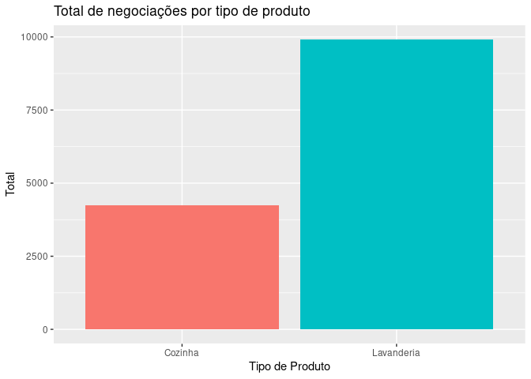
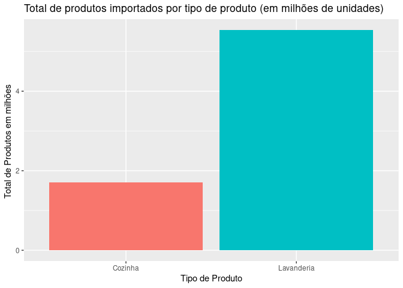
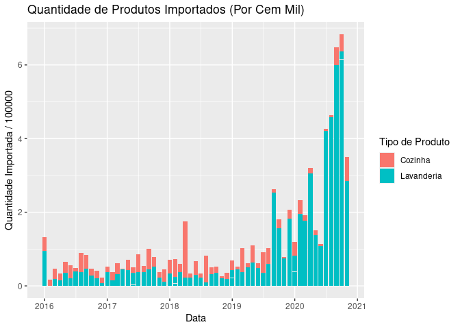
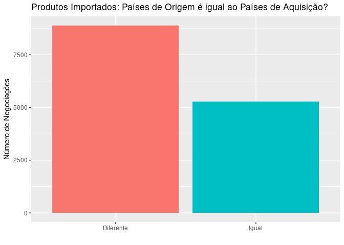

Processo Seletivo - 4intelligence
================
João Xavier

# Questão 2 (Programação)

## Carregando bibliotecas

``` r
library(tidyverse)
library(lubridate)
library(viridis)
```

## Item 1

``` r
dados <- readr::read_csv("importacao_siscori.csv",
                         locale = locale(encoding = "latin1"))
```

## Item 2

### Subitem a

``` r
dados <- dados %>%
    dplyr::mutate(anomes = lubridate::ym(anomes))
```

### Subitem b

#### Parte 1

``` r
aux1 <- stringr::str_detect(dados$descricao_do_produto,
                   "FOGÃO|Fogão|fogão|FOGÕES|Fogões|fogões")

dados$cod_ncm[aux1] <- "73211100"
```

**OBS**: É importante notar que os fogões já tinham esse código e que
outros produtos como churrasqueiras e cooktops também possuem o mesmo
código.

### Subitem c

``` r
dados2 <- dados %>% 
    dplyr::mutate(
        codigo_pedido = stringr::str_sub(dados$codigo_pedido, end = -6)
    ) %>% 
    dplyr::distinct(codigo_pedido, .keep_all = TRUE)
```

\***OBS**: Resolvi criar uma nova base de dados para manter a base
obtida dos primeiros itens para a análise pedida na questão 3.

# Questão 3

Para essa análise resolvi dividir os produtos da base de dados entregue
em duas parte, os produtos de cozinha (churrasqueira, fogão, cooktop) e
produtos de lavanderia (máquina de lavar, lavadora, secadora). Assim,
com essa divisão, podemos analisar quantos produtos foram negociados no
total e em cada ano. Primeiro, apresento o gráfico com o total de
produtos negociados na base de dados.

<!-- -->

Portanto, os produtos de lavanderia são a maior força da empresa, sendo
responsáveis por mais de um terço das suas importações. Todavia, outra
análise que pode ser feita é do total de produtos importados e não
apenas do número de importações:

<!-- -->

Esse segundo gráfico corrobora a tendência apresentada no primeiro, ou
seja, mostra a importância das importações de produtos de lavanderia.
Além disso, esse gráfico mostra que as importações de produtos de
lavanderia são mais numerosas que as importações de produtos de cozinha.
Por fim, outra análise que poderia ser feita é a de valor das
negociações, contudo não temos essa informação disponível nessa base de
dados.

Agora, podemos analisar se existe alguma tendência nas negociações dos
produtos ao longo do tempo, para isso, divido as importações
mensalmente, tal como a base de dados:

<!-- -->

Analisando os primeiros anos disponíveis é possível ver um certo
equilíbrio entre os dois tipos de produtos, com alguns meses destoando
um pouco da média tal como abril de 2018 para os produtos de cozinha e
janeiro de 2016 para os produtos de lavanderia. Contudo, na segunda
metade do ano de 2019 começa a ocorrer um distanciamento entre os dois
produtos e os itens de lavanderia começam a se tornar mais relevantes e
participativos chegando a um ponto que em 2020 praticamente todas as
negociações da empresa tornam-se desse tipo. É importante notar também
que o volume de negociações da empresa cresceu significativamente em
2019 e principalmente em 2020, mesmo que as importações de produtos de
cozinha tenham diminuído nesse período.

Em relação a análise de países de origem e país de aquisição talvez seja
interessante visualizar resolvi fazer uma abordagem simples, que é ver
em quantas negociações o país de origem é o mesmo do país de aquisição e
em quantas negociações eles são diferentes. Para isso, olhamos o gráfico
a seguir:

<!-- -->

Com isso, podemos ver que existe uma diferença considerável entre os
países de origem e países de aquisição da maioria das importações. Isso
pode ser interpretado como um fato gerada pela globalização e pelo
espalhamento das cadeias de produção e de transporte por todo o mundo ou
como um processo que pode ser melhorado e diminuir custos da empresa,
isto é, talvez importar dos países de origem do produto pode ser mais
barato, todavia isso exigira um estudo mais completo e mais dados em
relação aos preços e aos custos de transporte.

Por fim, um último estudo que poderia ser realizado com os dados desse
banco é em relação aos padrões de recebimento dos produtos, isto é, onde
eles são recebedidos. Além disso, com o trabalho que já foi feito de
segmentar os dados por tipo de produtos, podemos analisar quais tipos de
produto chegam mais em qual lugar. Essa análise poderia ser útil para
aprimorar os procedimentos da empresa. Para isso, eu analiso os 5
lugares que mais receberam importações da empresa ao longo desse
período.

<!-- -->

É notável nesse gráfico que apenas Itajaí e os outros grupos que estão
fora do top-5 recebem mais produtos de cozinha do que de lavanderia.
Todavia, os outros polos de recebimento são bastante intensivos em
produtos de lavanderia. Além disso, percebemos que o Porto de Santos é
claramente o maior dos locais, representando mais da metade do total ao
longo desse período. Ou seja, uma política importante para a empresa
analisada é avaliar como melhorar o recebimento e o transporte a partir
desses locais colocados no gráfico.
